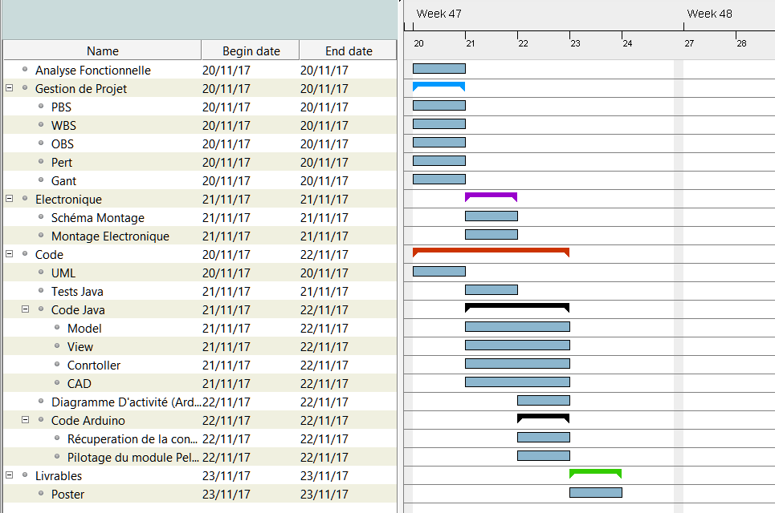

Cadrage du projet
=================

1. Cadrage du projet Table des matières
 - Charte projet
 - Plan de Management Projet (A5)
 - Cahier des charges (A2)
 - Planning (A1)
2. Réalisation du projet Analyse des risques (A4) 
  - Définition de l’architecture (A1)
  - Sprint Meeting (A repeter) (A1)
  - Développement du code en fonction des cas de tests (A repeter) (A1)
  - Daily meeting (A repeter) (A1)
3. Clôture du projet
  - Validation des tests fonctionnels (A1)
  - Evaluation de la vélocité (A1)
   - REX du projet (A1)
   - Bilan (A1)
4. Annexes- 
    - Outils
    - Organisation
## 1. Cadrage du projet Table des matières

Charte projet
-------------

### Objectifs (A1)

-   Création d’un frigo permettant de maintenir une température définie
    par l’utilisateur.

-   Le changement de la température intérieure doit se faire de sorte à
    ce qu’aucune condensation ne se forme.

-   Une alerte doit se déclencher si la porte reste ouverte pendant trop
    de temps.

-   Le refroidissement ne doit pas prendre trop de temps à refroidir
    le contenu.

-   Le frigo doit pouvoir être piloté par une application contenant une
    interface graphique

    -   L’utilisateur doit pouvoir modifier la température de consigne,

    -   L’interface doit afficher l’évolution des températures,

    -   Une indication doit apparaitre pour chaque alertes (Humidité &
        Porte Ouverte).

### Enjeux (A2)

Application des connaissances des prosits précédents.

-   Electronique (Montages des capteurs sur la carte Arduino),

-   Thermodynamique (Fonctionnement d’un module Peltier),

-   Informatique (Interface Homme Machine en Java).

### Macro Risques (A4)

### Macro planning (Etapes) (A1)

1.  Analyse Fonctionnelle

2.  Gestion de projet

3.  Electronique

4.  Informatique

    1.  Code Java

        1.  Modélisation (UML)

        2.  Implémentation

    2.  Code Arduino

5.  Livrables

### Acteurs (A1)

### Macro Budget (A5)

### Définition des responsabilité (A1)

Plan de Management Projet (A5)
------------------------------

### Gestion des exigences

### Gestion des risques

### Gestion de la qualité

### Gestion du changement

### Gestion des approvisionnements

### Gestion des RH

### Gestion des utilisateurs

### Gestion du budget

Cahier des charges (A2)
-----------------------

###  Besoins

-   Création d’un frigo permettant de maintenir une température définie
    par l’utilisateur.

-   Le changement de la température intérieure doit se faire de sorte à
    ce qu’aucune condensation ne se forme.

-   Une alerte doit se déclencher si la porte reste ouverte pendant trop
    de temps.

-   Le refroidissement ne doit pas prendre trop de temps à refroidir
    le contenu.

-   Le frigo doit pouvoir être piloté par une application contenant une
    interface graphique

    -   L’utilisateur doit pouvoir modifier la température de consigne,

    -   L’interface doit afficher l’évolution des températures,

    -   Une indication doit apparaitre pour chaque alertes (Humidité &
        Porte Ouverte).

### Contraintes

Utilisation du matériel fournit :

-   Carte Arduino,

-   Module Peltier,

-   Corps du frigo.

Date limite :

-   Vendredi 24 Novembre 2017.

### Critères de réussites

Affichage des températures sur l’IHM

Possibilité de régler la consigne sur l’IHM

### Tests fonctionnels

-   Lecture port série

-   Écriture port série

-   Modification du model par la CAD

-   Modification de la consigne par l’IHM

-   Alerte humidité

-   Alerte porte ouverte

-   Affichage des informations dans l’IHM

Planning (A1)
-------------

### OBS

### PBS

### WBS

### PERT

Version en ligne zoomable:

[*https://www.lucidchart.com/documents/edit/23d68692-8ccb-4809-a14c-2e99ee91843a?demo=on\#*](https://www.lucidchart.com/documents/edit/23d68692-8ccb-4809-a14c-2e99ee91843a?demo=on#)?

### GANTT

Réalisation du projet
=====================

Définition de l’architecture (A1)
---------------------------------

### Diagramme de composant

### Diagramme de paquetage

Sprint Meeting (A repeter) (A1)
-------------------------------

### Création d’une version

### Evaluation de la vélocité

### Planning Poker

### Modélisation et création des tests

*Diagramme de classe*

*Diagramme de séquence*

*Création des jeux de tests unitaires :*

Problèmes rencontrés lors de la visualisation des tests à écrire pour la
CAD

Test fonctionnels réalisés :

-   Lecture port série

-   Écriture port série

-   Modification du model par la CAD

-   Modification de la consigne par l’IHM

-   Alerte humidité

-   Alerte porte ouverte

-   Affichage des informations dans l’IHM

Développement du code en fonction des cas de tests (A repeter) (A1)
-------------------------------------------------------------------

Une branche par feature.

Daily meeting (A repeter) (A1)
------------------------------

Point quotidien sur l’avancement basé sur les ‘commit’ de l’équipe

Revu de code aléatoire par le chef de projet

Point sur les difficultés

Clôture du projet
=================

Validation des tests fonctionnels (A1)
--------------------------------------

Test fonctionnels réalisés :

-   Lecture port série

-   Écriture port série

-   Modification du model par la CAD

-   Modification de la consigne par l’IHM

-   Alerte humidité

-   Alerte porte ouverte

-   Affichage des informations dans l’IHM

Evaluation de la vélocité (A1)
------------------------------

REX du projet (A1)
------------------

-   Intéressant de communiquer avec une arduino

-   Intéressant de (re)voir les bases de la thermodynamique pour la vie
    courante

Bilan (A1)
----------

### Planning réel

Annexes
=======

Outils
------

### Versionning

Github :
[*https://github.com/NHURTEVENT/Projet-PMF*](https://github.com/NHURTEVENT/Projet-PMF)

### Gestion des exigences

Trello :
[*https://trello.com/b/HxT3Whu1/projet-pmf*](https://trello.com/b/HxT3Whu1/projet-pmf)

### Plannification

Trello :
[*https://trello.com/b/HxT3Whu1/projet-pmf*](https://trello.com/b/HxT3Whu1/projet-pmf)

Organisation
------------

### Sprint

Un sprint dure deux jours de travail pour ce projet

### Daily Meeting

A chaque démarrage de demi-journée.
